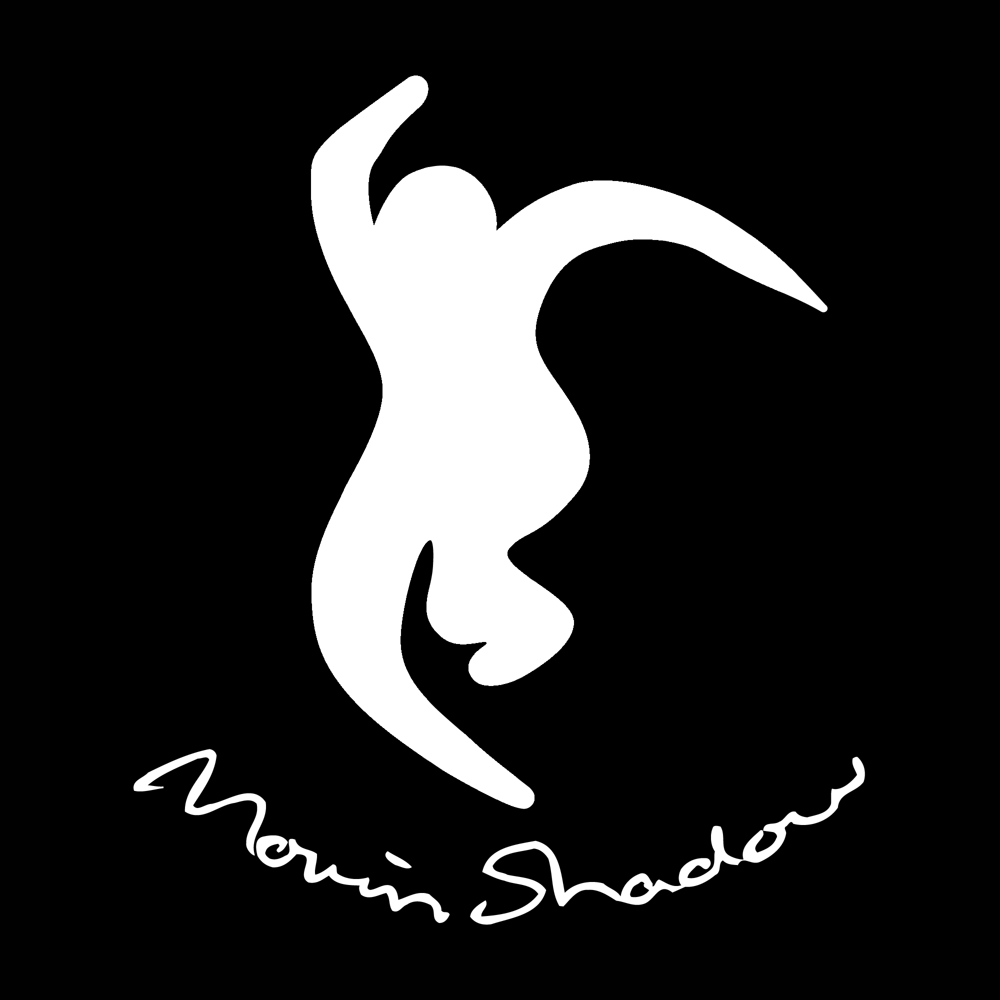

<!-- markdownlint-disable MD041 -->
<!-- markdownlint-disable MD033 -->

# Hi! I'm timecode 👋

producer/bit wrangler/score programmer/developer/hacker/code monkey/split personality

-   🖥  ⏐ coding: [golang](https://golang.org/), [python](https://www.python.org/)
-   💾  ⏐ tech: [apple](https://www.apple.com/), [cloudflare](https://www.cloudflare.com/), [aws](https://aws.amazon.com/), [linux](https://www.kernel.org/)
-   🎛  ⏐ proponent of [gtd](https://gettingthingsdone.com/what-is-gtd/) and [omnifocus](https://www.omnigroup.com/omnifocus)
-   🚲  ⏐ currently at [Moving Shadow](https://github.com/movingshadow), previously at [Starling Bank](https://github.com/starlingbank)
-   🇬🇧  ⏐ usually based in [London, UK](https://visitlondon.com/)
-   💻  ⏐ feel free to fork any of my [public repos](https://github.com/timecode?tab=repositories)
-   🤩  ⏐ also, feel free to …

    
<!-- markdownlint-enable MD033 -->
